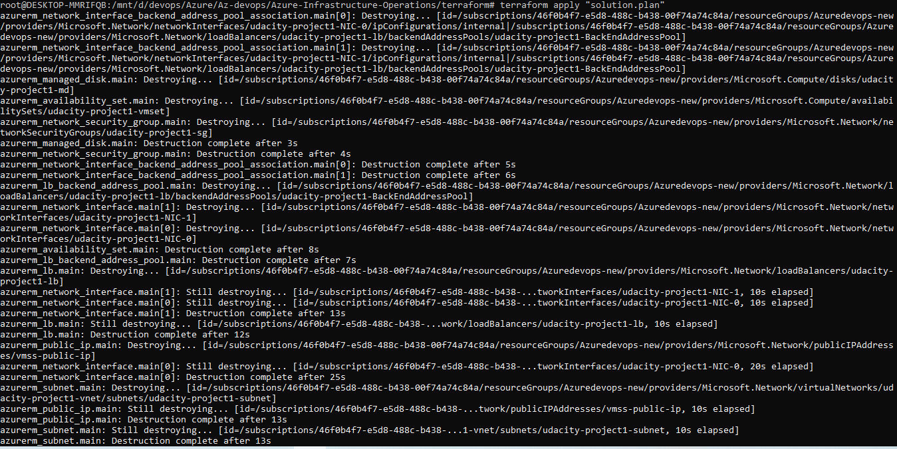
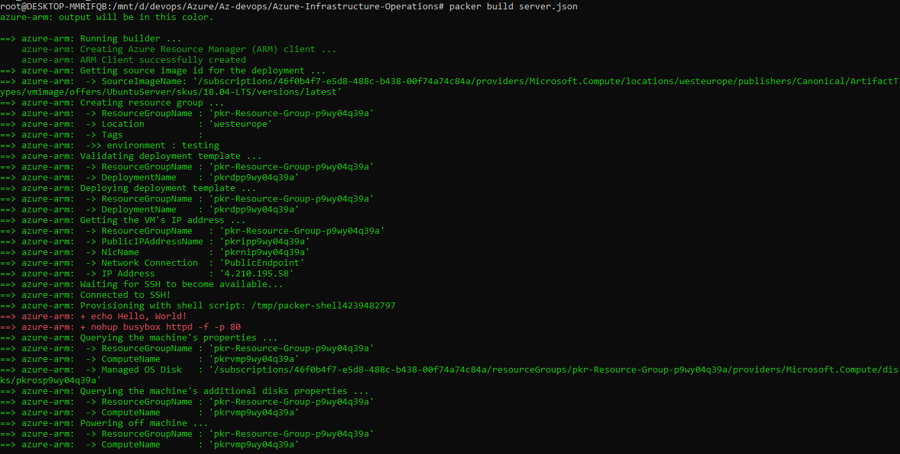
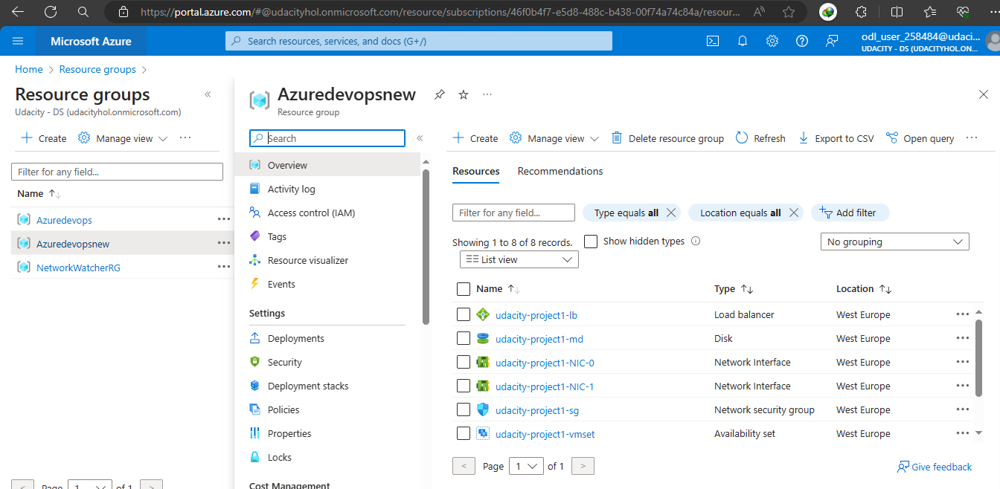
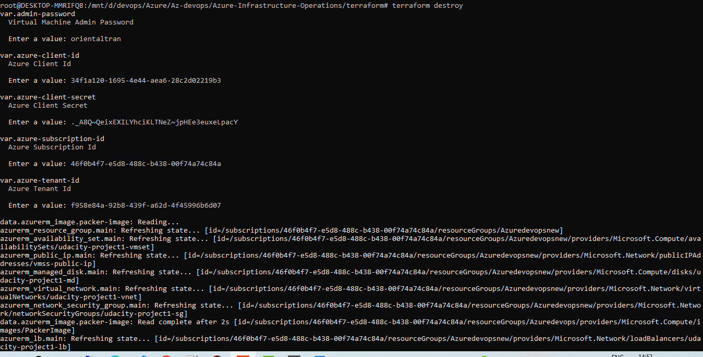

# Azure Infrastructure Operations Project: Deploying a scalable IaaS web server in Azure

### Introduction
For this project, you will write a Packer template and a Terraform template to deploy a customizable, scalable web server in Azure.

### Getting Started
1. Clone this repository

2. Create your infrastructure as code

3. Update this README to reflect how someone would use your code.

### Dependencies
1. Create an [Azure Account](https://portal.azure.com) 
2. Install the [Azure command line interface](https://docs.microsoft.com/en-us/cli/azure/install-azure-cli?view=azure-cli-latest)
3. Install [Packer](https://www.packer.io/downloads)
4. Install [Terraform](https://www.terraform.io/downloads.html)

### Instructions

#### Creating a Packer template
##### Config Environment Variables 

Edit environment in ```set-env.sh```

Navigate to the terminal and set the environment variables as shown below.

```bash
source set-env.sh
```

##### Deploy a policy
  - Navigate to the policy directory.
  - Run script executable:
  ``` bash
  chmod +x create_tagging_policy.sh 
  ```
  
  - Run the script to create the tagging policy
  ``` bash
  ./create_tagging_policy.sh 
  ```

  - Check that the policy exists
  ``` bash
  az policy assignment list
  ```
##### Create a resource group for packer image
  - Check resource group list
  ``` bash
az group list
  ```
  - Run the script to create a resource group
  ``` bash
  az group create -n <resource-group-name> -l <location> 
  ```

##### Packer Template - Create a Server Image
  - Update image_name, resource_group, location and vm_size in create_tagging_policy.sh
  - Run the script to create a server image
  ``` bash
  packer build server.json
  ```

### Creating a Terraform template
#### Terraform Template - Create the infrastructure
  - Navigate to the terraform directory
  - Initialize the workspace
  ``` bash
  terraform init
  ```
  
  - Check terraform syntax
  ``` bash
  terraform validate
  ```

  - Import existing resource group to terraform state
  ``` bash
  terraform import azurerm_resource_group.main /subscriptions/<subscription-id>/resourceGroups/<resource-group-name>
  ```

  - Plan before deploy
  ``` bash
  terraform plan -out solution.plan
  ```

  
  - Deploy the resources
  ``` bash
  terraform apply "solution.plan"
  ```


##### Destroy resources
  - Confirm destruction by typing "yes"
  ``` bash
  terraform destroy
  ```

#### Note about vars.tf

To tailor the vars.tf file for your needs, adjust the default values and descriptions of the variables to match your specific requirements. Below is an overview of the variables and instructions on how to customize them:

1. resource_group_name: This variable denotes the name of the resource group where resources will be created. Modify the default value to your desired resource group name.

2. location: This variable specifies the Azure region for resource deployment. Update the default value to your preferred region.

3. tags: This variable is a map of tags for deployed resources. Customize the default value to add or modify tags according to your tagging strategy.

4. packer_resource_group_name: This variable indicates the resource group where the Packer image will be created. Change the default value to your preferred resource group name.

5. packer_image_name: This variable defines the name of the Packer image. Update the default value to your desired image name.

6. prefix: This variable sets the prefix for all resources within the specified resource group. Modify the default value to your preferred prefix.

7. environment: This variable specifies the environment to be built (e.g., development, production, staging). Update the default value to reflect your desired environment.
azure-subscription-id, azure-client-id, azure-client-secret, azure-tenant-id: These variables are for Azure authentication. Provide your Azure credentials instead of the default values.

8. network-interfaces-count: This variable determines the number of network interfaces to create. Modify the default value to your desired count.

9. admin-user: This variable sets the username for the virtual machine's admin user. Update the default value to your preferred admin username.

10. admin-password: This variable represents the password for the virtual machine's admin user. Update the default value with your desired admin password, or modify it to prompt for the password during deployment.
vm-size: This variable defines the size of the virtual machine. Change the default value to your desired VM size.

11. num_of_vms: This variable determines the number of virtual machine resources to create behind the load balancer. Modify the default value to specify the desired number of VMs.

After customizing the variables in vars.tf, integrate them into your Terraform code to create and configure Azure resources according to your specific needs.

### Output

- `packer build server.json`



- `terraform apply`


- Resource in azure portal



- `terraform destroy`

