# Overview

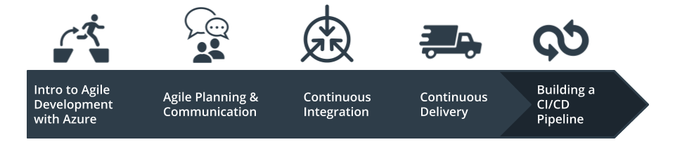

In this project, you will build a Github repository from scratch and create a scaffolding that will assist you in performing both Continuous Integration and Continuous Delivery. You'll use Github Actions along with a Makefile, requirements.txt and application code to perform an initial lint, test, and install cycle. Next, you'll integrate this project with Azure Pipelines to enable Continuous Delivery to Azure App Service.

## Project Plan
* Trello board: [Trello Board](https://trello.com/b/ZmXCqD4B/udacity-project-02)
* Project plan spreadsheet: [Project Plan](https://docs.google.com/spreadsheets/d/1ttoCh0Rcr2TrOr6ikpj6ZwxgfZ0UGhSptB6PCeKvsDM/edit#gid=0)

* For a visual demonstration of the project, please refer to this [YouTube video](https://youtu.be/G4Hc1VWK4NI).

## Instructions

* Connect Github with Azure Cloud Shell
   - SSH key generated:
     ```bash
     ssh-keygen -t rsa
     ```
   - Show and copy key:
     ```bash
     cat ~/.ssh/id_rsa.pub
     ```
   - Add new key to your GitHub profile (Settings => SSH keys > Add New)
   - Clone repository from GitHub to Azure Cloud Shell
     ```bash
     git clone git@github.com:orientaltran/azure-cloud-devlops.git
     ```

* Run and deploy the project
   - cd into the project directory
     ```bash
     cd azure-cloud-devlops
     ```
   - Create a virtual environment:
     ```bash
     make setup
      ```
   - Activate the virtual environment:
     ```bash
     source ~/.udacity-devops/bin/activate
     ```
     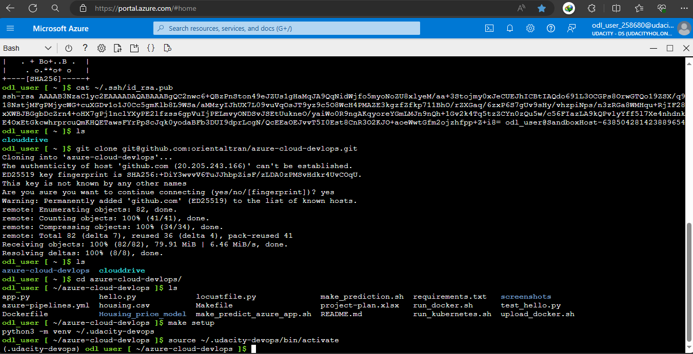

   - Install dependencies in the virtual environment and run tests:
     ```bash
     make all
     ```
     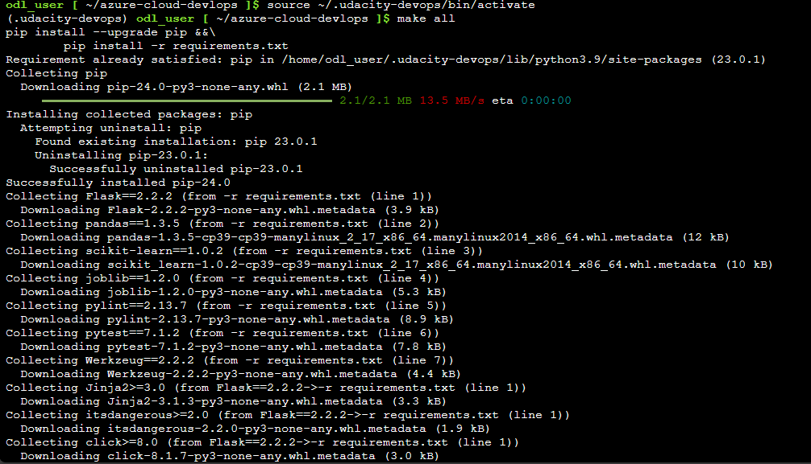
     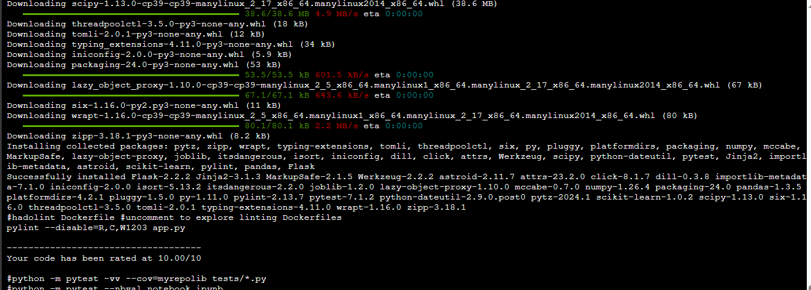

* Start the application in the local environment:
     ```shell
     export FLASK_APP=app.py
     ```

     ```shell
     flask run &
     ```
    Open a separate Cloud Shell and test that the app is working:
    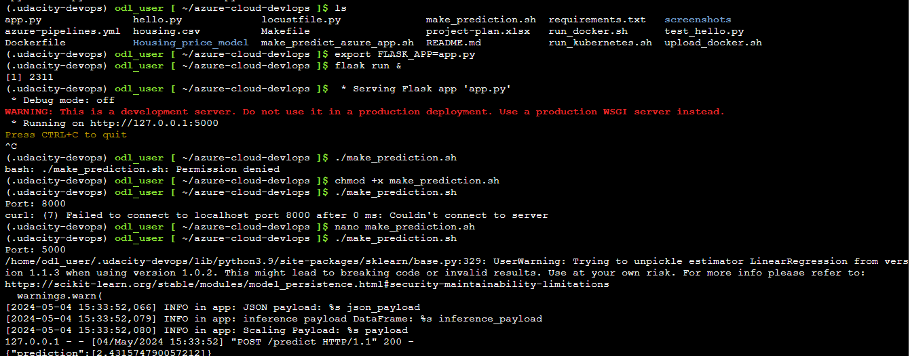

### Deploy the app to an Azure App Service

* Create an App Service in Azure. In this example the App Service is called `flaskmlapp`:

     ```shell
     az webapp up --sku F1 -n flaskmlapp -g Azuredevops
     ```

     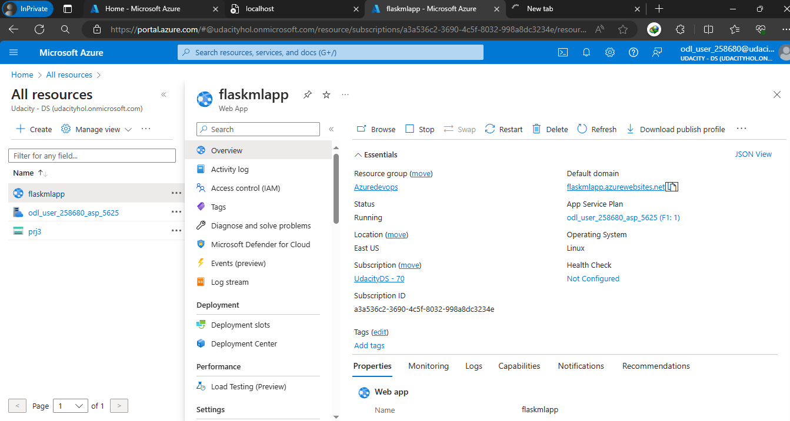

* Screenshot of a successful run of the project in Azure Pipelines:

     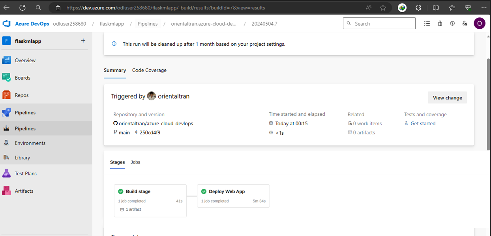

* Run `make_predict_azure_app.sh` script with the host name of your app. Then run the script:

     ```shell
     ./make_predict_azure_app.sh 
     ```

     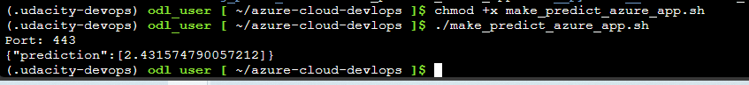

* You can also visit the URL of the App Service via the browser and you should see the following page:

     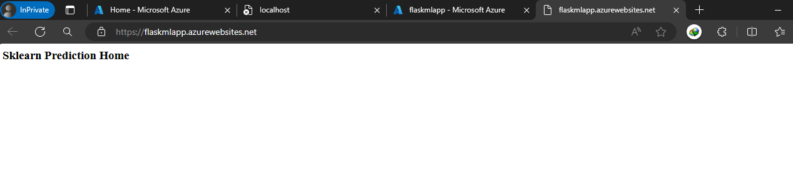

* View the app logs:

     ```shell
     az webapp log tail -g Azuredevops --name flaskmlapp
     ```

     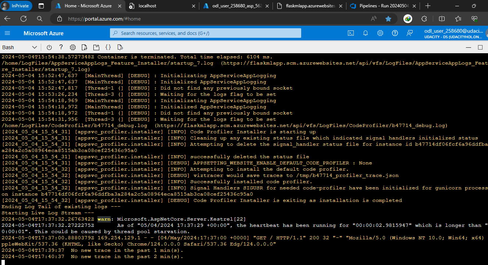

* Run Locust Test
    
    - We can use locust to do a load test against our application. 

     ```shell
     pip install locust
     ```

     ```shell
     locust -f locustfile.py
     ```

     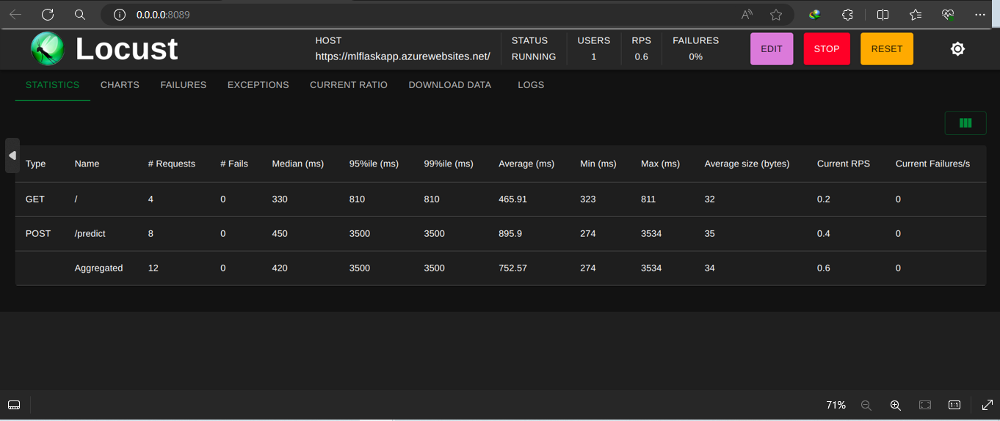